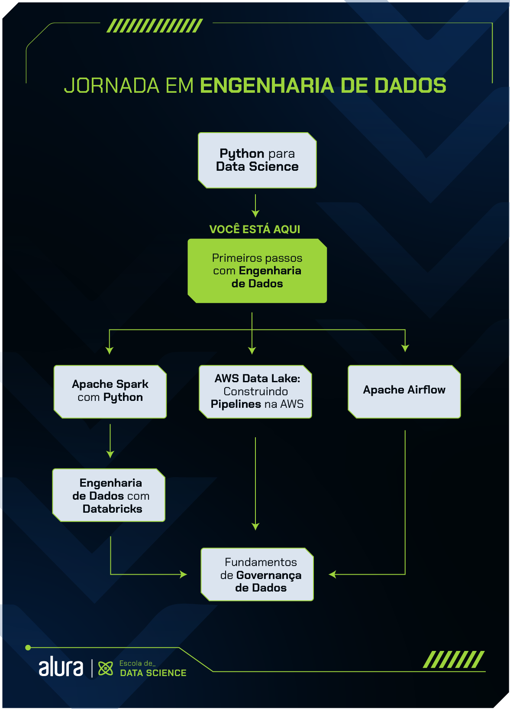

# [Formação Primeiros passos com **Engenharia de Dados**](https://cursos.alura.com.br/formacao-engenharia-dados-primeiros-passos)

A formação Primeiros passos com Engenharia de Dados busca preparar iniciantes da área de Engenharia de Dados para os desafios do dia a dia profissional, usando Python, SQL, NoSQL e 
outras ferramentas.

Funciona como um guia de aprendizado para auxiliar pessoas interessadas em entrar no mercado de trabalho e também como mecanismo de consulta para profissionais experientes.

**O QUE É ENGENHARIA DE DADOS?**

A Engenharia de Dados desempenha um papel crucial na indústria da tecnologia, permitindo que empresas de diversos setores coletem, armazenem, processem e analisem grandes volumes de dados em tempo real.

Profissionais especializados nessa área são responsáveis por projetar, implementar e manter a infraestrutura necessária para o gerenciamento eficiente dos dados de uma organização. Eles criam fluxos de dados que integram, limpam e transformam informações provenientes de diferentes fontes e formatos, possibilitando a geração de insights valiosos para a tomada de decisões empresariais.

**O QUE VAMOS APRENDER?**

Nesta formação, você terá a oportunidade de adquirir conhecimentos essenciais para ingressar na área de Engenharia de Dados. Exploraremos diversos tópicos fundamentais, como Python, SQL e pipelines de dados.

Iniciaremos aprendendo a construir pipelines ETL (Extract, Transform e Load) utilizando a linguagem Python, além de compreender como aplicar Programação Orientada a Objetos (POO) para tornar seus códigos mais legíveis.

Além disso, nesta formação, você terá a oportunidade de compreender a diferença entre bancos de dados SQL e NoSQL, assim como os principais conceitos relacionados a esses sistemas de armazenamento de dados.

Por fim, você consolidará todos os conhecimentos adquiridos ao longo dessa formação, desenvolvendo um pipeline completo de Engenharia de Dados. Você terá um primeiro contato com uma das ferramentas de gerenciamento de fluxos de dados, o Airflow. Essa experiência irá ampliar ainda mais suas habilidades e prepará-lo para enfrentar desafios reais na área de dados.

## [Curso de Pipeline de dados: combinando Python e orientação a objeto](https://cursos.alura.com.br/course/pipeline-dados-combinando-python-orientacao-objeto)

### Principais tópicos o curso:

- Construa um pipeline de dados com Python
- Refatore um código com orientação a objeto
- Transforme dados utilizando apenas Python
- Reconheça os benefícios de criar um pipeline reutilizável
- Estruture códigos Python em funções

## PRÉ-REQUISITOS PARA FAZER ESSA FORMAÇÃO.

Para aproveitar melhor esse conteúdo, é importante que você já tenha conhecimento dos conceitos-chave do Python aplicados à área de Data Science de forma abrangente.

## Passo a passo da Formação:

**1 - Python para Engenharia de Dados**

Neste passo inicial, o objetivo é que você se familiarize com a área da Engenharia de Dados, explorando o uso da linguagem Python e várias ferramentas de análise e gerenciamento de dados.

Na primeira etapa dessa jornada, você irá descobrir os fundamentos da Engenharia de Dados, aprenderá a importância de uma pessoa Engenheira de Dados no mundo atual, e como Python se aplica nesta área, aprendendo a criar seus próprios pipelines ETL.

Você também vai aprender a usar o WSL para executar programas e comandos Linux no Windows e a criar e gerenciar ambientes virtuais em Python. Além disso, terá uma introdução à Programação Orientada a Objetos (POO) e ao uso da biblioteca requests do Python para trabalhar com APIs. No final desta etapa, você será capaz de utilizar os principais recursos do Python para montar seus próprios pipelines e extrair, transformar e armazenar diferentes tipos de dados.

## Proximos Passos:

2 - Sistemas de armazenamento de dados

3 - Iniciando um projeto de Engenharia de Dados

4 - Conhecendo ferramentas de Big Data